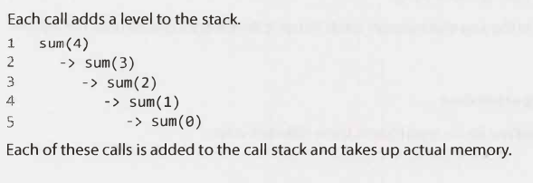
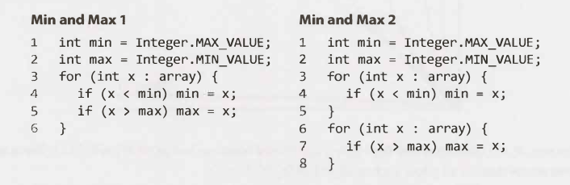
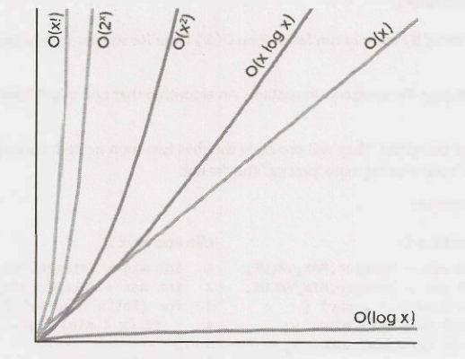
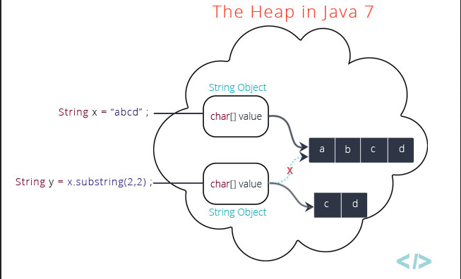

# Chapter 6: Big O

## Ankified Examples from the Chapter

### What is the **time** complexity and **space** complexity of this code fragment? 

```java
int sum(int n) { /* Ex. 1*/ 
    if (n <= 0) {
        return 0; 
    }
    return n + sum(n-1); 
}
```

- Time complexity: O(n). I think it is because the conditional `if` takes O(1) time and the return statement is made up of `n + sum(n-1)`, which is broken down into an O(1) operation to retrieve n and then an O(n-1) operation to retrieve (n-1), (n-2)...1 values and add them together. 

- Space complexity: O(n). For each additional n, where n is the size of the number, an additional call is added. Each additional call must maintain space to keep track of current value of _n_. For instance:
    - n = 0, takes one call sum(0)
    - n = 1, takes two calls: sum(1), sum(0)
    - n = 2, takes three calls: sum(2), sum(1), sum(0)
    - n = X, takes x+1 calls: sum(x), sum(x-1), ... sum(0)

- 


### This function has _n_ total calls. What is the space complexity? Why doesn't it take O(n) space? 

```java
int pairSumSequence(int n) { 
    int sum = 0; 
    for (int i = 0; i < n; i++) {
        sum += pairSum(i, i+1); 
    }
    return sum; 
}

int pairSum(int a, int b) {
    return a + b;
}
```

- O(1). The `pairSum()` function is called about _n_ times. However, the `pairSum()` calls don't exist at the same time. When the `pairSum()` function is called, it performs and returns a calculation before being removed from the call stack. Thus, there is only ever one `pairSum()` call on the call staack at any point in time, for O(1) space. 

### Why is an algorithm that is O(2N) actually O(N)? 



- The left fragment is O(n), in that it does two operations per each x. The right fragment is also O(n), but people might think it is O(2n) because it has two `for` loops that each do some operation n times (i.e. O(n+n) = O(2n)). However, if you look at the operations, the total number of operations performed are basically the same, so they're both O(n). 

### Why do you drop the **non-dominant terms** when expressing Big Oh? e.g. O(N<sup>2</sup> + N) => O(N<sup>2</sup>)? 

As the size of the input increases, the **growth** of the N<sup>2</sup> term becomes so large that it dwarfs the smaller term. 



### What is **Amortized Time**? 

Amortized time is the idea that an operation that takes O(N) time in the worst case, which happens less and less, and O(1) in the average case... will typically have O(1) time for the operation. 


### Examples and Exercises

#### Example 1. What is the runtime of the below code?

```java
void foo(int[] arr) {
    int sum = 0;
    int product = 1; 
    for (int i = 0; i < arr.length; i++) {
        sum+= array[i]; // O(1)
    }
    for (int i = 0; i < arr.length; i++) {
        product *= arr[i]; // O(1)
    }
    System.out.println(sum + ", " + product); 
}
```

There are two for loops, each doing a constant time operation n times. The code is doing O(2N) steps, but we drop the constant faactor, so the time complexity is O(N). 

#### Example 2

```java
void printPairs(int[] arr) {
    for (int i = 0; i < arr.length; i++) { // O(n)
        for (int j = 0; j < arr.length; j++) { // O(n)
            System.out.println(arr[i] + "," arr[j]); // O(1)
        }
    }
}
```

O(N<sup>2</sup>) time. The print operation takes O(1) time. The inner for loop repeats the print operation N times. The outer for loop repeats the inner for loop N times. Thus, the time complexity is O(N*N), which is O(N<sup>2</sup>). 

#### Example 3
```java
void printUnorderedPairs(int[] arr) {
    for (int i = 0; i < arr.length; i++) {
        for (int j = i+1; j < arr.length; j++) {
            System.out.println(arr[i] + "," + arr[j]); 
        }
    }
}
```

The time complexity will still be O(N<sup>2</sup>). The outer for-loop repeats the inner for loop N times. The inner for-loop runs at (N-1) + (N-2) + (N-3)... 1 times.  Still, it's going to be about N<sup>2</sup>/2 which is O(N<sup>2</sup>). 


How does Gayle explain it? 
- Basically, on the first iteration, of i, there will be _j_ runs, which are N-1. On the second iteration, it will be N-2, then N-3, ... until there are only 2 and 1 steps remaining. 
- She says that the sum of 1 + 2 + 3 ... (N-1) steps (from above) amounts to (N)(N-1)/2 ... which is O(N<sup>2</sup>/2-N/2). You can drop the constant (i.e. the 1/2) and you can drop the non-dominant term (i.e. the N). What you have left is O(N<sup>2</sup>). 

#### Example 4

```java

void printUnorderedPairs(int[] arrayA, int[] arrayB) {
    for (int i = 0; i < arrayA.length; i++) { // O(A.length)
        for (int j = 0; arrayB.length; j++) { // O(B.length))
            if (arrayA[i] < arrayB[j]) {
                System.out.println(arrayA[i] + "," + arrayB[j]); // sysout is O(1)
            }
        }
    }
}
```

The inner for-loop repeats an O(1) operation `arrayB.length` times, which we abbreviate to O(B). The outer for-loop repeats the inner for-loop O(arrayA.length) times, which we abbreviate to O(A). We don't know the lengths of arrays A and B before hand, so we are unable to combine the two as O(N<sup>2</sup>).  Therefore, the run time is O(A*B). 

#### Example 5. 

```java
void printUnorderedPairs(int[] A, int[] B) {
    for (int i = 0; i < A.length; i++) { // O(A.length)
        for (int j = 0; j < B.length; j++) { // O(B.length)
            for (int k = 0; k < 100_000; k++) { // O(100_000) boils down to O(1) operation. 
                System.out.println(A[i] + "," + B[j]); // O(1) operation
            }
        }
    }
}
```

The inner-most for-loop repeats an O(1) operation 100_000 times, so it boils down to O(1). The j for-loop repeats the O(1) operation O(B.length) times, abbr as O(B) times. The outer-most loop repeats the O(B) operation O(A) times. Therefore, the run time is O(A*B). 

#### Example 6. The following code reverses an array. 

```java
void reverse(int[] arr) {
    for (int i = 0; i < arr.length/2; i++) { // O(N/2)
        int other = arr.length - 1 - 1; // O(1)
        int temp = arr[i]; // O(1)
        arr[i] = arr[other]; // O(1)
        arr[other] = temp; // O(1) 
    }
}
```

O(n). The loop contents are constant time operations, O(1), that are repeated n/2 times. 

#### Example 7. Which of the following are equivalent to O(N)? Why?

- O(N + P), where P < N/2
    - You can substitute (N/2) for P to get O(1.5N), which is O(N). 
- O(2N)
    - Drop the constant factor to get O(N). 
- O(N + log N)
    - Drop the non-dominant term, log N, to get O(N). 
- O(N + M). 
    - You don't have enough information about M to get O(N), so this remains as O(N+M). 

#### Example 8. Suppose we had an algorithm that took in an array of strings, sorted each string, and then sorted the full array. What would the runtime be? 

Attempt at recalling/figuring out the solution: 

First off, I think that strings are stored as character arrays. I'm not sure what sorting algorithm is used on each string. The fastest sorting algorithm I know, in terms of Big Oh, is mergesort, which is O(n log n). Therefore, in the worst case for any particular string length is O(c log c), where c is the maximum number of characters in a string. Once we've sorted the string, we want to sort the array of strings. The comparison between strings to sort them might take n log n time, where n is the number of strings. 

So far, we have O(c log c) and this operation is repeated O(n log n) times. Therefore it'd be Big Oh of (c * log c)*(n * log n), which would be:
    - (c log c)(n) * (c log c)(log n)
    - cn log c * c log c log n? 

Read the next paragraph, corrections:

We need to sort the strings (c log c) and do that s times (# of strings) and then sort the array (s log s) That's going to be O(sc log c) * (s log s) times. 

We can factor out s to get (s)(c log c + log s)? 

##### Notes after reading the solution 

Define `s` to be the length of the longest string. 
Define `a` to be the length of the array.
Sort each string O(s log s). 
Repeat the sorting process for _every_ string, O(a*s log s). 
Sort all the strings. There are `a` strings. Each string comparison takes O(s) time. There are O(a log a) comparisons, so the runtime for sorting all strings is O(a*s log a) time. 
We can combine the O(a\*s log s) + O(a\*s log a) to be O(a\*s(log a + log s)). 

##### Recall attempt: 

I'll define `s` as the number of strings in the array and `c` as the number of characters in the longest string. 

Sorting takes O(n log n) times. Applying this logic to sorting a single string, the sorting process will take O(c log c) times. We need to that for each string, so it'll take O(s * c log c) time. 

Now it's time sort all the strings. There are `s` strings. 

Why does string comparison take O(c) times? Basically, you compare up to `c` characters until you figure out which string should go before the other. Only then, can you determine the order of the string and sort the strings in O(s log s) times. That's going to be O(c * s log s), which is equivalent to O(s * c log s).

The total runtime would be O(s\*c log c) + O(s\*c log s). You can factor out the s*c to get O(s\*c(log c + log s)). 

#### Example 9. The following simple code sums the values of all the nodes in a balanced binary search tree. What is its runtime? 
```java
int sum(Node node) {
    if (node == null) return 0; // O(1) 
    return sum(node.left) + node.value + sum(node.right); // O(2^depth) aka O(2^(log nodes)) or O(nodes, including the empty nodes)
}
```

#### Example 10. The following method checks if a number is prime by checking for divisibility on numbers less than it. 

It only needs to go up to the square root of n because if n is divisble by a number greater than its square root, then it's divisible by something smaller than it. 

For example, while 33 is divisible by 11 (which is greater than the square root of 33), the "counterpart" to 11 is 3 (3*11 = 33). 33 will have already been eliminated as a prime number 3. 

What is the time complexity of this function? 
```java
boolean isPrime(int n) {
    for (int x = 2; x*x <= n; x++) { 
        if (n % x == 0) return false; // O(1) 
    }
    return true; 
}
```

I think the critical piece is `x*x <= n`. This looks is x<sup>2</sup> <= n. You can then take the square root of both sides to get the number of iterations in the worst case, so it would be O(n<sup>0.5</sup>). 

#### Example 11. The following code computes n! (n factorial). What is its time complexity? 

```java
int factorial(int n) {
    if (n < 0) return -1; // O(1)
    else if (n == 0) return 1; // O(1)
    else return n * factorial(n-1); 
}
```

The factorial function will be called once for n = 1, another time for n = 2, (2 * (factorial(1)) * factorial(0)). For each additional increase in n, there will be another call, so it will be O(n). 


#### Example 13. The following code computes the Nth Fibonacci number. 

```java
int fib(int n)  {
    if (n <= 0) return 0;  // O(1)
    else if (n==1) return 1; // O(1)
    return fib(n-1) + fib(n-2); // O(2^(n-1)) which is O(2^n)
}

```

The runtime is O(2<sup>n</sup>) because for each additional increase in n, there will be a doubling of function calls. 


#### Example #14. The following prints all Fibonacci numbers from 0 to n. 

```java
void allFib(int n) {
    for (int i = 0; i < n; i++) {
        System.out.println(i + ": " + fib(i)); 
    }
}

int fib(int n) {
    if (n<=0) return 0; 
    else if (n==1) return 1; 
    return fib(n-1) + fib(n-2); 
}
```

I think it will be O(2<sup>n</sup>*n). Turns out, that my answer is wrong!

The reason is that n changes, as it goes from fib(1) to fib(2)... fib(n). Thus, we do 2^1 + 2^2 work... + 2^n work, which is still 2^n. 


#### Example 12. This code counts all permutations of a string. 

```java
void permutation(String str) {
    permutation(str, ""); 
    // Calls and overloaded variant of permutation. 
}

void permutation(String str, String prefix) {
    if (str.length == 0) { // O(1) operation because checking the length and then printing out the value for the prefix takes constant time. 
        System.out.println(prefix); 
        // TODO: The prefix begins as "", but does it increase in size or something? 
    } else {
        for (int i = 0; i < str.length(); i++) { // O(str.length), which is O(n). 
            String rem = str.substring(0, i) + str.substring(i+1); 
            // How does substring work? 
            // What is the number of steps? 
            permutation(rem, prefix + str.charAt(i)); 
            // It seems that permutation is calling itself and appending the i-th character from str to prefix. 
        }
    }
}
```

##### How does the program work according to Gayle? 

How many times does `permutation` get called in its base case? 
- n!. For a string with 5 characters, the first character has 5 options, the second character can be 4 options, ... the last character has one option for which character it can be. THus, 5x4x3x2x1, which is 5!. 

How many times does permutation get called before its base case? 

- Gayle says that there are n! leaves from above, and that each leaf has a path of length `n` , so the max number of function calls is `n * n!`. 

What is the runtime for each function call? 
    - What is the runtime of line 7, `System.out.println(prefix)`? 
        - O(n), where `n` is the number of characters in the `prefix`. 
    - What is the runtime of line 10 and line 11?
        ```java
        String rem = str.substring(0, i) + str.substring(i+1);
        permutation(rem, prefix + str.charAt(i)); 
        ``` 
        - O(n) combined. Line 10 creates a substring of length (n-1). Line 11 adds a character to prefix, so there are `n` characters to be added, so O(n) for adding to strings. 
    - Therefore, each function call will do O(n) work. 

What is the total runtime? 
- `Permutation` is called at most O(n * n!) and each call requires O(n) time. Therefore the total runtime is less than O(n<sup>2</sup>*n!). 


How does the program work? 
- A `str` is input into the `permutation(str)` function, which then calls another `permutation(str, prefix)` function. 
- This second `permutation()` variant is a recursive function. 
    - It starts with a full `str` and an empty `prefix` string. 
    - As long as there are characters left in `str`, the program will create a new `rem` string and copy the `str` except for the `i`-th character. 
    - Then, `permutation()` will call itself with the smaller `rem` string and larger `prefix` because the `prefix` will now include the `i`-th character. 
    - The removal of the `i`-th character from `str` and addition of the character to `prefix` will repeat until there are no more characters in the `str` argument. 
    - The base case is an empty `str` argument, which then prints out the permutation. 

- 
    if (str.length == 0) { // O(1) operation because checking the length and then printing out the value for the prefix takes constant time. 
        System.out.println(prefix); 
        // TODO: The prefix begins as "", but does it increase in size or something? 
    } else {
        for (int i = 0; i < str.length(); i++) { // O(str.length), which is O(n). 
            String rem = str.substring(0, i) + str.substring(i+1); 
            // How does substring work? 
            // What is the number of steps? 
            permutation(rem, prefix + str.charAt(i)); 
            // It seems that permutation is calling itself and appending the i-th character from str to prefix. 
        }
    }

 

##### Study Questions / Things to Follow Up On

What is the runtime for printing strings? 
- O(n), where `n` is the length of the string.

What is the runtime for string concatenation? 
- O(n) where `n` is the number of characters to add. 

What is the runtime for the `substring()` from the `String` class as of Java 8? 
- O(n) because it [makes a copy of the string up to the number of characters specified](https://stackoverflow.com/a/4679775 ). 
- 

##### Recall 

- Line 10-11 requires O(n) times for the string concatenation and substring methods: 
    - The `substring()` method takes O(n) time in Java 8+, where `n` refers to the number of characters in the string. This method requires O(n) time because it creates a new String object and copies over the characters in the specified range (e.g. `substring(0, i)` copies the characters from 0 to `i`). String concatenation also requires O(n) for each character being added to a string. 
- Line 7 requires O(n) times: 
    - Time to print a string increases in O(n) time, as the number of characters to print grows, so does the time grow linearly. 
- Line 9 repeats Line 10-11 O(n) times. 

So far, the overloaded `permutation()` function is going to take O(n<sup>2</sup>) operations, not including the function call on line 10. 

- Line 11 will be called `n!`. On the first pass, it'll be called `n-1` times, then `n-2`, ... `2, 1` times. 
- Therefore, if we multiply the runtime together, then it's O(N<sup>2</sup>*n!). 

##### Explanation Draft

Permutation will call itself `n!` times in line 11. The `for` loop will repeat that action `n` times. There will be `n! * n` function calls. In each call, there will be O(n) steps to either print out the `prefix` string in line 7 or create the `rem` string and add the `i`-th char to the prefix. Thus, there will be O(n*n!) calls, each of which take O(n) time to complete, so the Big Oh is O(n<sup>2</sup> * n!). 

##### Want To Dos

- [x] Recall 
- [x] Try to review it again
- [ ] Look at https://stackoverflow.com/questions/44430566/understanding-example-12-all-permutations-of-a-string-from-big-o-notation-crac to try and understand CTCI
- [ ] Cont. creating study questions/revising understanding of example #12. 

#### Example 15. The following code prints all Fibonacci numbers from 0 to n. However, this time, it stores (i.e. caches) previously computed values in an integer array. if it has already been computed, it just returns the cache. What is its runtime? 

```java
void allFib(int n) {
    int[] memo = new int[n + 1]; 
    for (int i = 0; i < n; i++) {
        System.out.println(i + ": " + fib(i, memo)); 
    }
}

int fib(int n, int[] memo) {
    if (n <= 0) return 0; 
    else if (n == 1) return 1;
    else if (memo[n] > 0) return memo[n]; 

    memo[n] = fib(n-1, memo) + fib(n-2, memo); 
    return memo[n]; 
}
```

##### First Attempt 

- For an integer, `n`, generate an array of integers whose length is `n + 1`. StackOverflow seems to state that array initialization is O(1) from the standpoint of algorithm analysis, so I'll go with that. 
- For each integer from 0 to `n`, not including `n`, print out the `i`-th fibonacci value. This `for` loop repeats an action about `n` times, so the runtime for this portion is O(n). 
- Now, the question is, what is the runtime of `fib()`. 
    - The `if` statement and `else if` statements take constant time, O(1). 
    - `return memo[n]` takes O(1) because it directly accesses the value in memo[]. 
    - The `memo[n] = fib(n-1, memo) + fib(n-2, memo);` will call `fib` twice. In this example, `fib` is called from a `for` loop that increments `i` by 1. Thus, this `memo[n] = fib(n-1, memo) ... `line should only run once per iteration. As such, I think it is O(1) in this context. 
- Overall, I think the runtime is O(n). 

##### Solution 

The runtime is indeed O(n). The `fib(i-1)` and `fib(i-2)` values are already calculated when `fib(i)` is called. Thus, accessing those values is O(1) due to array properties. Summing the two values is also O(1). Thus, you're repeating an O(1) operation N times, which is O(`n`). 