# Quicksort Chapter 4

## Learning Goals

- Learn about **divide-and-conquer**
- Learn about **quicksort**

What is _divide and conquer_ (D&C)? 
- A "recursive technique for solving problems". Recursion in this context means that the technique breaks down a problem into smaller problems. Then, it solves these smaller problems. Once it solves the smaller problems, it can solve bigger problems. It repeats this process of solving bigger and bigger problems based on the solutions it came up with for the smaller problems until it finishes solving the entire problem. 

Why is D&C important?
- D&C represents "another tool in your toolbox", so you can ask "'Can I solve this if I use divide and conquer?'". 

What is _quicksort_? 
- A D&C algorithm that lets you sort lists. 

## Divide & conquer 

1. Find the base case; the simplest case. 
2. Divide the problem until it becomes the base case. 

The example that the book gives is kind of mindblowing to me. For instance, using divide and conquer, you can quickly find the largest, even, subdivision of farmland into _square_ plots. That is, you can divide it up until every subdivision of the farmland is a square and every square is the largest square possible given that every subdivision is a square. 

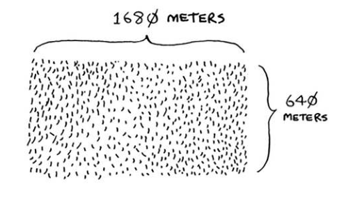

You might try the following, which don't work:

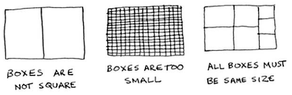

However, D&C allows you to easily get to the correct answer, which is 80 x 80 m subdivisions: 

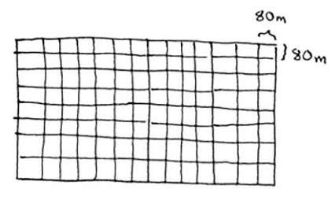

### How did that work? 
1. First, you find the _simplest_ base case, i.e. what's the easiest problem to solve? 
    - The easiest is a rectangle that turns into _n_ squares when divided by _n_. That is, one side is _n_ as long as the other. For instance, 50m x 25m square has one side 2x as long as the other, so if you divide it into two, you get two squares. 
    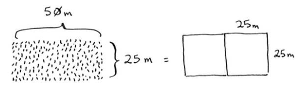

2. Break down the problem until it gets to the base case. 
    1. Start with dividing the farmland using the largest boxes you can use. 
    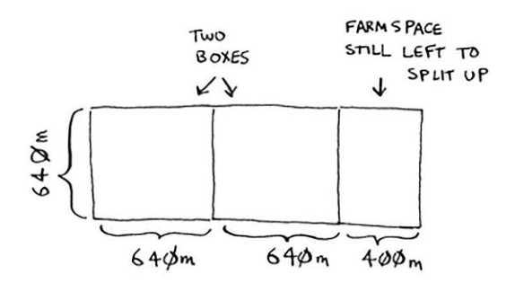 becomes
    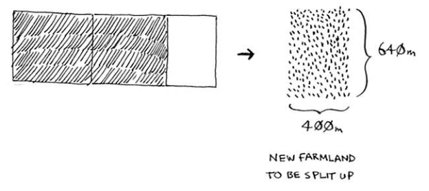, which is 640m x 400m
    2. Repeat that algorithm on the left-over land. The largest square box you can make using this left-over is 400x400, so you get a left-over of 240m x 400m. 
    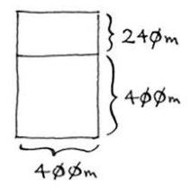
    3. Repeat the algorithm with 240x400m to get 240m x 160m.  
    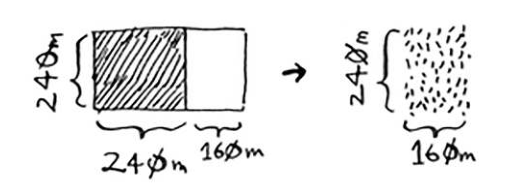
    4. Do it again to get 160m x 80m. You've found the base case because 160m is a multiple of 80m! 
    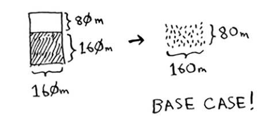
    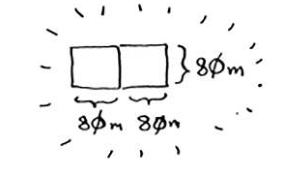
3. Now, just divide the farm into plots of 80m x 80m to get the biggest square subdivisions of farmland possible. 

### Array Example 

Given an array of numbers, use recursion to add up all the numbers.
e.g. `2 4 6`

- **Base case**: An array of size 0 or 1. 
    - IF the array is size 0, return 0. 
    - ELSE IF the array is size 1, return that element. 
- **Recursive case**: Everything else. 
    - Get the sum of the 1th element and the sum of the rest of the elements. 

If the array has zero elements, return 0. Otherwise, return the sum of the first element plus the sum of the rest of the elements. 

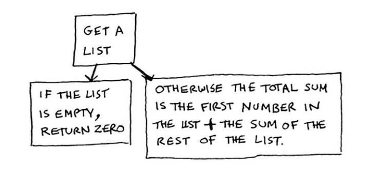

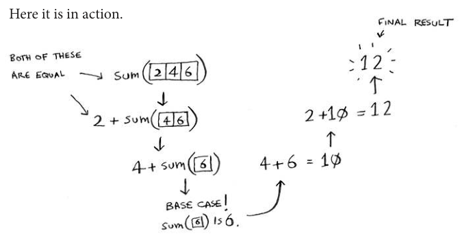

### Exercises

> 4.1 Write out the code for the earlier `sum` function.

First Attempt
```py
def sum(list): 
    if len(list) == 0:
        return 0

    lastElement = list[len(list)-1]
    smallerList = list[0, len(list)-1]

    return sum(lastElement + sum(smallerList)))
```

> 4.2 Write a recursive function to count the number of items in a list. 

First attempt
```py
def count(list): 
    if len(list) == 0:
        return 0
    smaller_list = list[0, len(list)-1]
    else: 
        return 1 + count(smaller_list)
```

> 4.3 Find the maximum number in a list. 

Attempt
```py
def max(list): 
    if len(list) == 0: 
        return 0
    curr_max= list[0] # The first element in the list
    smaller_list = list[1:len(list)]
    if curr_max < smaller_list_max:
        curr_max = smaller_list_max
    else:
        return curr_max 
```

The sum function was to get a list:
- If the list is empty, return 0.
- Otherwise, the total sum is the first number in the list plus the sum of the rest of the list. 

How would I apply that to find the maximum number in the list? 

Get a list:
- If the list is empty, return 0.
- Else: 
    - The maximum number is the max between the first number in the list and the max number in the rest of the list. 

For [2, 4, 6]... 

max(2, 4, 6 ) ---->  
2, max(4, 6) ---> 6 > 2 --> 6
4, max(6) ------> 6 > 4 --> 6
6, max() ----> 6 > 0 ---> 6
base case: max() is 0 

To make things simpler, make the base case a list with one element.

max(2, 4, 6 ) ---->  6
2, max(4, 6) ---> 6 > 2 --> 6
4, max(6) ------> 6 > 4 --> 6
Base case: max(6) ---> 6 

In other words, the max of a list is the max of its sublists. 

```py
# Takes in a list and the current max, which starts at 0. 
def max(list, currMax):
    # If the list is empty, then the max of that list is 0. 
    if len(list) == 0: 
        return currMax
    # If the list has only one element and it's greater than the current max, then that element is the current max. 
    if len(list) == 1 and list[0] > currMax: 
        return list[0]
    else: 
    # Return the current max. 
        return currMax 
    # If the list has more than one element, then max is the max between the first element in the list and the current maximum for the list. 
    if list[0] > currMax:
        return max(list[1, len(list)], list[0])
    
    return max(list[1, len(list), currMax])
```

> 4.4 Remember binary search from chapter 1? It's a divide-and-conquer algorithm, too. Can you come up with the base case and recursive case for binary search? 

- **Base case** When there are zero elements remaining, then the binary search will return None/null/-1 to indicate the target value. 

- **Recursive case**: While the range of elements to search through is one or more elements, the binary search will:
    1. The binary search will guess that the target value is in the middle of the array. 
    2. If the guess is equal to the target value, then binary search will return the index of the guess. 
    3. If the guess is greater than the target value, then it'll search in the middle of the bottom half of the array. 
    4. If the guess is smaller than the target value, then it'll search in the middle of the top half of the array. 

```py
# Recursive Binary Search Algorithm Attempt 
def binary_search(list, lo, hi, target): 
    # Base Case: There are no elements to check. 
    if ( lo > hi ): # e.g. 0 > -1
        return None
    # Recursive Case: There are at least one elements to check. 
    mid = (lo + hi) // 2
    guess = list[mid]
    if guess == target: 
        return mid
    if guess > target: 
        hi = mid-1
    if guess < target: 
        lo = mid+1
    return binary_search(list, lo, hi, target)
```

## Quicksort 

What is **quicksort**? 
- A sorting algorithm based on the divide and conquer method. 
- What are the base cases of quicksort? 
    - An empty array and an array with only one element. 

```py
def quicksort(array):
    if len(array) < 2:
        return array
```

How do you sort an array with two elements? 
- If the first element is larger than the second element, swap them. 
    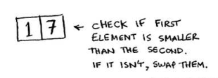

How do you sort an array with three elements using D&C / quicksort? 
    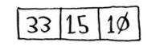

1. Break down the array until you get to the base case. How?
    1. Pick a **pivot**, the element you'll use to subdivide the array into smaller pieces. 
    2. Sort the elements into a sub-array of elements smaller than the pivot, the pivot, and a sub-array of elements greater than the pivot. 
        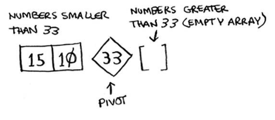
    3. If there are two elements in one of the sub-arrays, repeat the quicksort process of picking a pivot and sorting the elements. 
        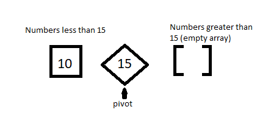
2. Add the arrays together, recursively. 
    1. Add the [10], [15] and [ ] together to get [10, 15]. 
        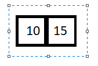
    2. Add the [10, 15] and [33] together.
        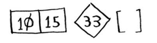 


### Code for quicksort? 

```py
def quicksort(array): 
    if len(array) < 2: 
        return array # Base case: arrays with 0 or 1 elements are already "sorted"
    else: 
        pivot = array[0] # Recursive Case 
        less = [i for i in array[1:] if i <= pivot] # Sub-array of all the elements less than the pivot. 
        greater = [i for i in array[1:] if i > pivot] 

        return quicksort(less) + [pivot] + quicksort(greater) 

```


### Exercises

> How long would each of these operations take in Big O notation? 
> 4.5. Printing the value of each element in an array. 

O(n). You are applying a constant time operation, i.e. printing a value, to _each_ element in the array. Thus, for an array of size _n_, you're printing values _n_ times. 

> 4.6. Doubling the value of each element in an array.

O(n). See 4.5. 

> 4.7 Doubling the value of just the first element in an array. 

O(1). No matter how big the array is, you're only going to do the constant time operation once. 

> 4.8. Creating a multiplication table with all the elements in teh array. So if your array is [2, 3,  7, 8, 10], you first multiply every element by 2, then multiply every element by 3, then by 7, and so on. 

For each _n_-th element in the array, you're multiplying it by _n-1_ elements in the array. Therefore, you're doing _n_ * (_n_-1) operations, which is O(n<sup>2</sup>) operations. 

## Recap - Ankified 

{{c2:: D&C (Divide and conquer)::This method used for solving problems }} works by {{c1::chunking/breaking down}} a problem into {{c1::smaller}} and {{c1::smaller}} pieces. 

Why is **quicksort** sometimes faster than **merge sort**? 
- The constant factor in quicksort is faster than merge sort, so in the average case where both have O(n log n) performance, quicksort will be faster. 

Why does the constant almost never matter for simple search vs. binary search? 
- O(log n) is so much faster than O(n) when your list gets big. 


If you're using D&C on a list, the base case is probably an {{c1::empty}} array or an array with {{c2::one}} element. 
- D&C = divide and conuquer 

### Different Variations on Fill-In-The-Blank QuickSort Code

```py
def quicksort(array): 
    if len(array) < 2: 
        return array # Base case: arrays with 0 or 1 elements are already "sorted"
    else: 
        pivot = array[0]
        less = [i for i in array[1:] if i <= pivot] # Sub-array of all the elements less than the pivot.  
        _____________________________________________

        return quicksort(less) + [pivot] + quicksort(greater)
``` 
- `greater = [i for i in array[1:] if i > pivot]`


```py
def quicksort(array): 
    if len(array) < 2: 
        return array # Base case: arrays with 0 or 1 elements are already "sorted"
    else: 
        pivot = array[0]
        ___________________________________________ 
        greater = [i for i in array[1:] if i > pivot] 

        return quicksort(less) + [pivot] + quicksort(greater)
``` 
- `less = [i for i in array[1:] if i <= pivot]`
- Extra: This means create a `# Sub-array of all the elements less than the pivot. `

```py
def quicksort(array): 
    if len(array) < 2: 
        return array # Base case: arrays with 0 or 1 elements are already "sorted"
    else: 
        ________________
        less = [i for i in array[1:] if i <= pivot] # Sub-array of all the elements less than the pivot. 
        greater = [i for i in array[1:] if i > pivot] 

        return quicksort(less) + [pivot] + quicksort(greater)
``` 
- `pivot = array[0]`


```py
def quicksort(array): 
    if len(array) < 2: 
        ____________
    else: 
        pivot = array[0]
        less = [i for i in array[1:] if i <= pivot] # Sub-array of all the elements less than the pivot. 
        greater = [i for i in array[1:] if i > pivot] 

        return quicksort(less) + [pivot] + quicksort(greater) 
``` 
- `return array`
- Extra: `# Base case: arrays with 0 or 1 elements are already "sorted"`


```py
def quicksort(array): 
    __________________
        return array # Base case: arrays with 0 or 1 elements are already "sorted"
    else: 
        pivot = array[0]
        less = [i for i in array[1:] if i <= pivot] # Sub-array of all the elements less than the pivot. 
        greater = [i for i in array[1:] if i > pivot] 

        return quicksort(less) + [pivot] + quicksort(greater)
``` 
- `if len(array) < 2:`


```py
def quicksort(array): 
    if len(array) < 2: 
        return array # Base case: arrays with 0 or 1 elements are already "sorted"
    else: 
        pivot = array[0] # Recursive Case 
        less = [i for i in array[1:] if i <= pivot] # Sub-array of all the elements less than the pivot. 
        greater = [i for i in array[1:] if i > pivot] 

        _____________________________________________________
``` 
- return quicksort(less) + [pivot] + quicksort(greater) 

```py
def quicksort(array): 
    if len(array) < 2: 
        return array # Base case: arrays with 0 or 1 elements are already "sorted"
    else: 
        pivot = array[0] # Recursive Case 
        less = [i for i in array[1:] if i <= pivot] # Sub-array of all the elements less than the pivot. 
        greater = [i for i in array[1:] if i > pivot] 

        return _______________ + [pivot] + quicksort(greater)
``` 
- quicksort(less)

```py
def quicksort(array): 
    if len(array) < 2: 
        return array # Base case: arrays with 0 or 1 elements are already "sorted"
    else: 
        pivot = array[0] # Recursive Case 
        less = [i for i in array[1:] if i <= pivot] # Sub-array of all the elements less than the pivot. 
        greater = [i for i in array[1:] if i > pivot] 
        
        return quicksort(less) + [pivot] + __________________
```
- quicksort(greater)

```py
def quicksort(array): 
    if len(array) < 2: 
        return array # Base case: arrays with 0 or 1 elements are already "sorted"
    else: 
        pivot = array[0] # Recursive Case 
        less = [i for i in array[1:] if i <= pivot] # Sub-array of all the elements less than the pivot. 
        greater = [i for i in array[1:] if i > pivot] 
        
        return quicksort(less) + _______ + quicksort(greater) 
```
- [pivot]


## To-Do

```py
def quicksort(array): 
    if len(array) < 2: 
        return array # Base case: arrays with 0 or 1 elements are already "sorted"
    else: 
        pivot = array[0] # Recursive Case 
        less = [i for i in array[1:] if i <= pivot] # Sub-array of all the elements less than the pivot. 
        greater = [i for i in array[1:] if i > pivot] 

        return quicksort(less) + [pivot] + quicksort(greater) 
``` 


-  [ ] What does `[i for i in array[1:]]` do on a step by step basis? 
-  [ ] What does `[i for i in array[1:] if i > pivot]` do on a step by step basis? 