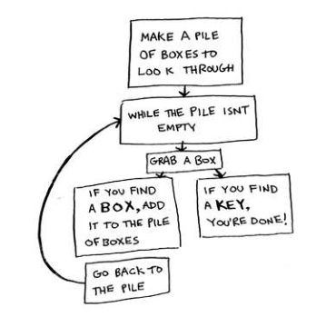

# Recursion, Chapter 3

## Learning Objectives

- Learn what is **recursion**
- Learn how to break a problem down into its **base case** and **recursive case**.

## Recursion

### Grandma's Boxes

You have a box that contains other boxes. These boxes are nested, i.e. they contain other boxes too, like Russian dolls:


There are two main ways to find the key. You can use an **iterative** aproach or a **recursive** approach. The iterative approach involves using loops whereas the recursive approach involves making an algorithm that calls itself.

#### Iterative

```
Create a pile of boxes to look through
WHILE there are boxes in the pile:
    Open the box
    If the item in the box is a box:
        Add the item to the pile
    If the item is the key:
        You're done!
```



#### Recursive

```
Check each box/item in Grandma's box
If the item is a box:
    Check every item in that box
If the item is a key:
    You're done!

```


## Base Case vs. Recursive Case

### What's a **recursive case**?

The part of the function where the function calls itself.

```py
def countdown(number):
    print(number)
    countdown(number-1) # The function calls itself.
```

### What's a **base case**?

The condition/statement you include in your code so that your program doesn't loop forever. For instance, the recursive case above will cause the program to loop forever because there is nothing to tell the program to stop.

To make the code stop, include a **base case**:

```py
def countdown(number):
    if number <= 0: # Stop counting down once we've reached 0.
        return
    else:           # Keep counting down for as long as our number is still greater than 0.
        countdown(number-1)
```

## What is a **stack**?

A **stack** is an organized pile of items where the items are placed on top of each other. When you want to add items to the stack, you put the items on the top. When you want to take items from the stack, you take them from the top of the stack. Basically, any time you do something with a stack, you're going to either _push_ (insert) or _pop_ (remove) items to or from the top of the stack.


### What is the **call stack**? 

A call stack is a **stack** used by the computer to keep track of the function calls and the variables for the function calls. 

When the computer calls a function, it adds the function call and the variables values for that function to the stack. 


If that the function calls another function before it finishes running, then the computer _pushes_ that second function to the top of the stack. The computer pauses execution of the first function, which means that the first function was _partially completed_. 


When the computer is finished with the second function, it _pops_ it off and returns to running the first function call. 


The computer picks up where it left off with the first function call and then repeats the above process if it calls another function. 


Then, once the function is rully run, the function is also popped off the call stack and there is nothing else left to run. 

## Exercise

> 3.1 Suppose I show you a call stack like this.


> What information can you give me, just based on this call stack?

I think you can say that the "Greet" function is partially completed and that it has called the "Green2" function. The "Greet" function is paused. The Greet2 funciton makes use of the name variable like the Greet function. Once the Greet2 function completes, then the Greet function will resume execution. Once the Greet function is done, then the call stack is empty. 

> 3.2 Suppose you accidentally write a recursive function that runs forever. As you saw, your computer allocates memory on the stack for each function call. What happens to the stack when your recursive function runs forever?

The call stack continues to grow for as long as the recursive function runs. If the function runs forever, then the call stack runs forever. 

Updated answer after checking the answers: The computer has a limited amount of memory. The call stack requries an increasing amount of memory as the recursive function runs. Eventually, the call stack will require more memory than the computer has available. Therefore, the computer will stop running due to a **stack-overflow** error. 

## Recap Ankified

{{c1::Recursion}} is when a function calls {{c2::iteself}}. 

Every recursive function has two cases: the {{c1::base}} case and the {{c2::recursive}} case. 

All function calls go onto the {{c1::call}} stack. 
