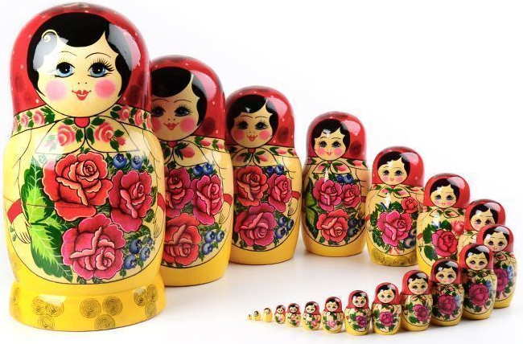
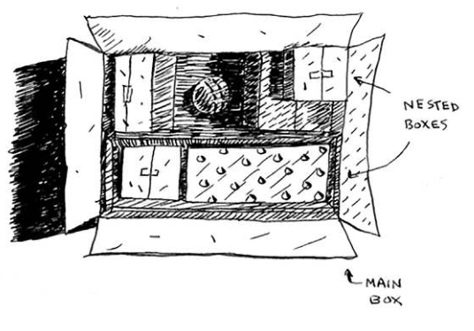

# Recursion, Chapter 3

## Learning Objectives

- Learn what is **recursion**
- Learn how to break a problem down into its **base case** and **recursive case**. 

## Recursion 

### Grandma's Boxes

You have a box that contains other boxes. These boxes are nested, i.e. they contain other boxes too, like Russian dolls:





There are two main ways to find the key. You can use an **iterative** aproach or a **recursive** approach. The iterative approach involves using loops whereas the recursive approach involves making an algorithm that calls itself. 

#### Iterative

```
Create a pile of boxes to look through
WHILE there are boxes in the pile:
    Open the box
    If the item in the box is a box:
        Add the item to the pile
    If the item is the key:
        You're done!
```


#### Recursive

```
Check each box/item in Grandma's box
If the item is a box:
    Check every item in that box
If the item is a key:
    You're done!

```


## Base Case vs. Recursive Case

### What's a **recursive case**?

The part of the function where the function calls itself. 

```py
def countdown(number):
    print(number)
    countdown(number-1) # The function calls itself. 
``` 

### What's a **base case**? 

The condition/statement you include in your code so that your program doesn't loop forever. For instance, the recursive case above will cause the program to loop forever because there is nothing to tell the program to stop. 

To make the code stop, include a **base case**:

```py
def countdown(number):
    if number <= 0: # Stop counting down once we've reached 0. 
        return
    else:           # Keep counting down for as long as our number is still greater than 0.
        countdown(number-1)
```


## The stack? 

