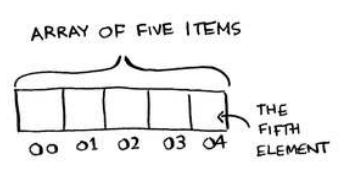

# Selection Sort - Chapter 2

## Learning Goals

- Learn about **arrays** and **linked lists**
- Be able to explain the tradeoffs between arrays and linked lists
- Be able to sort your list using **selection sort**

## How does memory work?

Your computer memory is like a "chest of drawers". When you have items to store, the computer will assign you some drawers to leave things in.

Each of the drawers has an address.

What's the general process for storing items?

1. Get some space in the memory
2. Get the address to this space
3. Use either an array or list to store the items

## Arrays and linked lists

How are arrays stored in memory?

- The items in an array are stored **contiguously**, i.e. right next to each other in the memory space.

What happens if there isn't enough allocated space to store everything next to each other?

- You have to ask the computer for another memory spot.

- Every time the array fills up, a new array has to be initialized to store more items.

What's the alternative to creating a new array each time you want to add an extra item?

- Make a bigger array, e.g. 10 spots for 10 items instead of 3 items. That way, when you want to add more items, you can use the same array.
- What's the problem of making a bigger array?
  - The empty spots are wasted until you use them. It's like reserving seats in a restaurant. Having a 10-seat round table is great when you have a lot of guests. But if you are only eating with one other person, then that's 8 seats you've wasted. It's even more costly if there is a mandatory gratuity and you're charged tips for 10 people instead of tips for 2 people. That's what it's like with arrays: Making bigger arrays lets you store more items, but the extra storage comes at a cost.
  - You might still have to make a bigger array you add more than 10 items!

### Linked Lists

How do linked lists solve the problem of adding items to full lists?

- Instead of requiring items to be next to each other, linked lists allow you to store items anywhere in memory. That way, you don't have to relocate the entire list and there isn't exactly a set maximum for how many items you can store.

How do linked lists work then?

- When you store an item in a linked list, you store it in a memory location and also store a pointer to the next item in the linked list.

What are the downsides of linked lists?

- You have to view items one at a time because items can be stored anywhere in memory and you only know where a particular item is based on the pointer in the previous item (in a singly-linked list).

- By contrast, arrays are useful for **random access**, i.e. viewing any item in the list because it's easy to tell where an item is located.

### Why does it take O(n) time to insert an element into an array? Suppose you want to insert an element at the beginning of an array? How would you do it? How long would it take?

O(n) time means that in the worst case, it takes about n steps to insert an element into an array. When you insert an element into the last available spot in an array, you don't have to move any other element, so it takes O(1) time. However, if there is already a value in that spot, then you have to move that value over to the right by one. For each extra index that's already full, n, the number of steps taken grows by n factors, so that's O(n). 

Suppose you have an array with 5 spots: `_ _ _ _ _`.

1. Insert an element, 1, into index 0 (the first spot) takes constant time because there isn't anything there: `1 _ _ _ _`
2. Inserting an element, 2, into index 0 takes an extra step because there is already a value in index 0. First, move the 1 to index 1 to make space:
   1. `_ 1 _ _ _`. Now, you can insert 2.
   2. `2 1 _ _ _`. That took an extra step.
3. Inserting another element, 3, into index 0 take yet another step because now you have to move elements 2 and 1.
   1. `2 _ 1 _ _ ` First, move 1 so that 2 can be moved over. 
   2. `_ 2 1 _ _ ` Second, move 2 over to the right so 3 can fit. 
   3. `3 2 1 _ _ ` Now you can insert 3. 

### Exercise 

> 2.1 Suppose you’re building an app to keep track of your finances.
> Every day, you write down everything you spent money on. At the end of the month, you review your expenses and sum up how much you spent. So, you have lots of inserts and a few reads. Should you use an array or a list?

Since there are few reads, then random access shouldn't be an issue, so that's one less reason to use an array. 

The next thing to consider is _where_ you want to be able to insert the items. If it's into any particular spot, then it'll take O(n) time for insertion using an array or O(1) for a linked list. However, if it's at the end of the list sequentially, then it'll be O(1) time for both linked lists and arrays. I'll assume that you want to be able to organize the list, to make things easier for you to keep track of. Sorting involves insertion, deletions, etc, which takae O(N) time in arrays. Therefore, I'd recommend linked lists so you can insert items wherever you want. 

## Selection sort

## Recap
